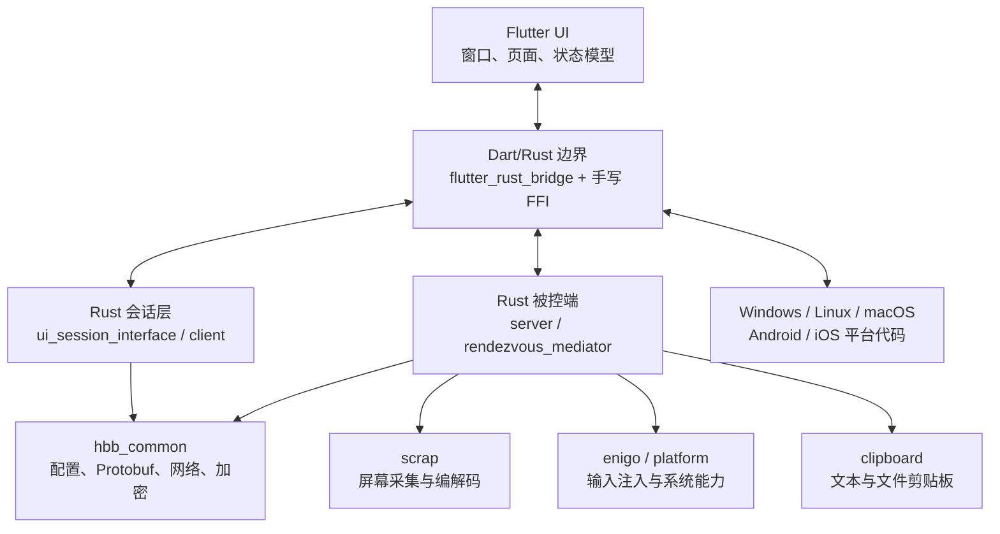
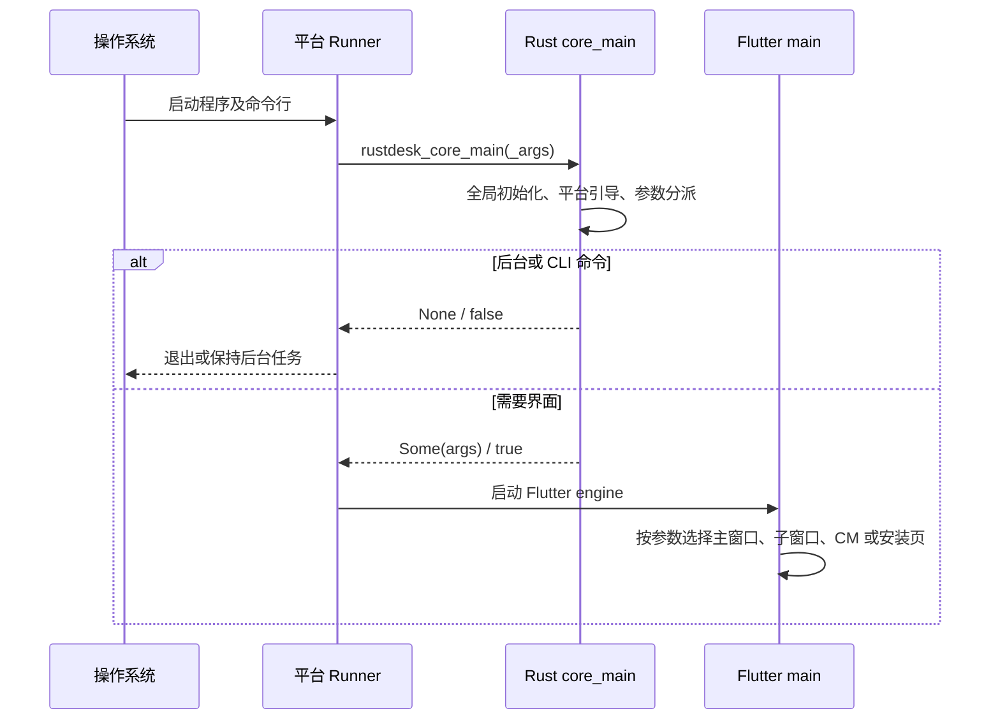
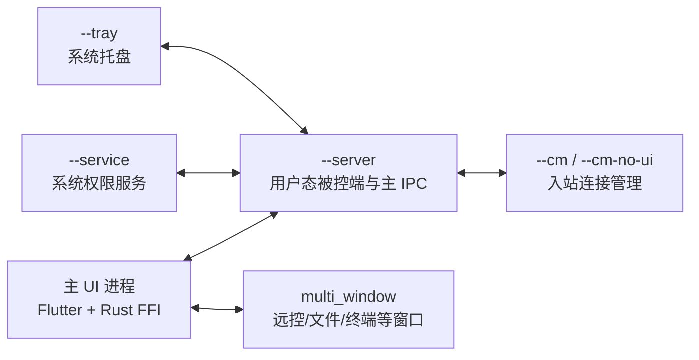
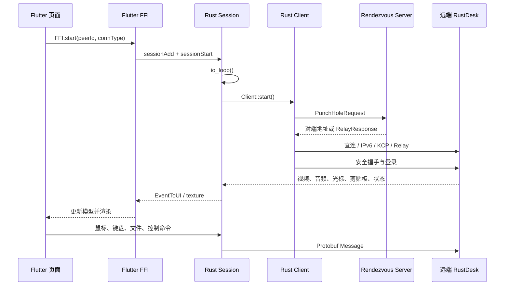
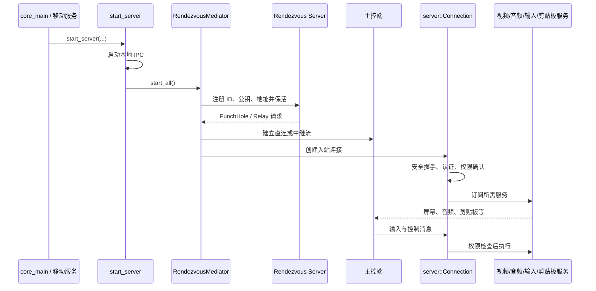

# RustDesk 客户端架构说明

> 本文面向首次阅读 RustDesk 客户端源码的开发者，说明程序入口、启动链路、核心模块、运行时边界和主要数据流。内容以当前仓库源码为准；RustDesk Server（`hbbs`/`hbbr`）是独立项目，不在本仓库中实现。

## 1. 架构概览

RustDesk 客户端采用 **Flutter 界面 + Rust 核心 + 平台适配层** 的分层架构：

- Flutter 负责当前桌面端和移动端界面、窗口管理及界面状态；旧 Sciter UI 仍保留在 `src/ui/`，但只在未启用 `flutter` feature 时编译。
- Rust 核心负责设备注册、连接协商、加密通信、远程会话、音视频、文件传输、剪贴板和输入控制。
- `flutter_rust_bridge` 生成的绑定和少量手写 FFI/平台通道连接 Dart、Rust 与原生平台代码。
- `libs/` 下的内部 crate 提供协议与配置、屏幕采集、输入注入、剪贴板、虚拟显示器等基础能力。

Rust crate 的模块装配和平台条件编译集中在 [`src/lib.rs`](../src/lib.rs#L1)，Cargo workspace、动态/静态库产物及辅助二进制定义见 [`Cargo.toml`](../Cargo.toml#L1)。

## 2. 程序入口

### 2.1 桌面 Flutter 应用

桌面发行版并非直接从 `src/main.rs` 启动 Flutter。各平台原生 Runner 会先调用 Rust 核心入口，Rust 决定当前命令是后台模式还是需要继续显示 Flutter UI。

这里容易混淆“Flutter 工程先启动”和“Flutter UI 先启动”。更准确的说法是：操作系统先启动 Flutter 桌面工程里的原生 Runner；此时 Flutter Engine 和 Dart UI 还没有跑起来。Runner 先调用 Rust 导出的入口做启动分发；只有 Rust 返回“需要界面”时，Runner 才继续创建 Flutter Engine、加载 Dart 入口并显示窗口。因此架构上可以说桌面包的外壳来自 Flutter 平台工程，但启动决策先交给 Rust。

| 平台 | 原生入口 | Rust 预处理 | Dart 入口 |
| --- | --- | --- | --- |
| Windows | [`wWinMain`](../flutter/windows/runner/main.cpp#L20) 动态加载 `librustdesk.dll` | 调用 `rustdesk_core_main_args()`，并把需要 Flutter 处理的参数传给 Runner | [`main(List<String> args)`](../flutter/lib/main.dart#L41) |
| Linux | [`main`](../flutter/linux/main.cc#L68) 动态加载 `librustdesk.so` | 调用 `rustdesk_core_main()`；返回 `false` 时不启动 Flutter | [`main(List<String> args)`](../flutter/lib/main.dart#L41) |
| macOS | [`MainFlutterWindow.awakeFromNib`](../flutter/macos/Runner/MainFlutterWindow.swift#L39) | 调用进程内的 `rustdesk_core_main()` | [`main(List<String> args)`](../flutter/lib/main.dart#L41) |

两个导出的 Rust 入口均包装 [`core_main()`](../src/core_main.rs#L31)：非 Windows 使用 [`rustdesk_core_main()`](../src/flutter.rs#L106)，Windows 使用可返回参数数组的 [`rustdesk_core_main_args()`](../src/flutter.rs#L126)。`core_main()` 返回 `None` 表示命令已由 Rust 处理、进程应退出；返回 `Some(args)` 表示继续启动 UI。

Flutter 桌面入口按启动参数分派窗口（见 [`flutter/lib/main.dart`](../flutter/lib/main.dart#L41)）：

- `multi_window`：远程桌面、文件传输、查看摄像头、端口转发或终端子窗口；
- `--cm`：连接管理器窗口；
- `--install`：安装界面；
- 无上述参数：主窗口，并启动本机被控服务。

所有分支都会通过 [`initEnv()`](../flutter/lib/main.dart#L123) 初始化平台 FFI、全局 FFI 和事件处理。主窗口由 [`runMainApp()`](../flutter/lib/main.dart#L136) 启动，最终桌面显示 `DesktopTabPage`，移动端显示 `HomePage`（[`App.build()`](../flutter/lib/main.dart#L486)）。

### 2.2 Flutter 桌面 Runner 与 Rust 库配置

`flutter/windows`、`flutter/linux` 和 `flutter/macos` 下的 Runner 工程来自 Flutter 桌面模板，Flutter 工具会维护其中一部分文件，尤其是 `flutter/*/flutter/` 下的托管构建规则和 `ephemeral/` 生成文件。业务开发通常不直接改这些托管文件；RustDesk 只在平台 Runner 和平台构建脚本中加入必要的自定义代码，让原生宿主能够先调用 Rust，然后再启动 Flutter。

桌面 Runner 不是 Dart 代码生成出来的界面本身，而是承载 Flutter Engine 的原生宿主：

| 平台 | 原生宿主入口 | Flutter 宿主/构建配置 | Rust 如何被宿主找到 |
| --- | --- | --- | --- |
| Windows | [`flutter/windows/runner/main.cpp`](../flutter/windows/runner/main.cpp#L20) 的 `wWinMain` | [`flutter/windows/CMakeLists.txt`](../flutter/windows/CMakeLists.txt#L62) 引入 Flutter 托管规则并添加 `runner`；[`runner/CMakeLists.txt`](../flutter/windows/runner/CMakeLists.txt#L11) 定义 `rustdesk.exe`，链接 `flutter` 和 `flutter_wrapper_app` | `main.cpp` 通过 `LoadLibraryA("librustdesk.dll")` 和 `GetProcAddress("rustdesk_core_main_args")` 调用 Rust；顶层 CMake 将 `target/<debug|release>/librustdesk.dll` 安装到 exe 同级目录 |
| Linux | [`flutter/linux/main.cc`](../flutter/linux/main.cc#L68) 的 `main` | [`flutter/linux/CMakeLists.txt`](../flutter/linux/CMakeLists.txt#L49) 引入 Flutter 托管规则，定义 GTK Runner，并链接 `flutter`、GTK、`dl` | `main.cc` 通过 `dlopen`/`dlsym("rustdesk_core_main")` 调用 Rust；CMake 将 `target/<debug|release>/liblibrustdesk.so` 安装为 bundle 的 `lib/librustdesk.so`，并设置 `RPATH=$ORIGIN/lib` |
| macOS | [`flutter/macos/Runner/MainFlutterWindow.swift`](../flutter/macos/Runner/MainFlutterWindow.swift#L39) 的 `awakeFromNib` | [`Runner.xcodeproj`](../flutter/macos/Runner.xcodeproj/project.pbxproj#L245) 包含 `Runner` 和 `Flutter Assemble` 目标；[`Flutter-*.xcconfig`](../flutter/macos/Flutter/Flutter-Release.xcconfig#L1) 引入 Flutter 生成配置 | Rust 符号通过 macOS Runner 工程/桥接头进入同一进程，Swift 直接调用 `rustdesk_core_main()`，随后创建 `FlutterViewController` |

Rust 侧能被 C++/Swift 调用，靠的是库目标和 C ABI 导出，而不是普通 Rust 二进制入口：

- [`Cargo.toml`](../Cargo.toml#L11) 将库声明为 `cdylib`/`staticlib`/`rlib`，桌面 Flutter 包使用其中的动态库产物；
- [`Cargo.toml`](../Cargo.toml#L28) 的 `flutter` feature 启用 `flutter_rust_bridge`；
- [`src/flutter.rs`](../src/flutter.rs#L106) 和 [`src/flutter.rs`](../src/flutter.rs#L126) 使用 `#[no_mangle] pub extern "C"` 导出稳定符号，供 `GetProcAddress`、`dlsym` 或 Swift 桥接调用；
- [`build.py`](../build.py#L928) 先构建 Rust 库，再执行 `flutter build`，最后由各平台构建脚本把 Flutter 运行时、Dart assets/AOT 产物、插件库和 Rust 动态库放进同一个桌面包。

所以“在哪里配置 Flutter 让它调用 Rust”可以分成两层看：

1. 启动阶段的 Runner 调 Rust：配置在 `flutter/windows/runner/main.cpp`、`flutter/linux/main.cc`、`flutter/macos/Runner/MainFlutterWindow.swift` 以及对应 CMake/Xcode 工程里。
2. UI 运行后的 Dart 调 Rust：配置在 [`flutter/pubspec.yaml`](../flutter/pubspec.yaml#L42) 的 `flutter_rust_bridge` 依赖、生成的 Dart bridge、[`flutter/lib/models/native_model.dart`](../flutter/lib/models/native_model.dart#L136) 的动态库加载逻辑，以及 [`src/flutter_ffi.rs`](../src/flutter_ffi.rs) 暴露给生成绑定的 Rust API 中。

### 2.3 Rust 原生入口与辅助二进制

[`src/main.rs`](../src/main.rs#L1) 是 Cargo 默认二进制 `rustdesk` 的入口：

- 非 Flutter 桌面构建调用 `core_main()`，需要 UI 时进入旧 Sciter [`ui::start()`](../src/main.rs#L24)；
- Android、iOS 或启用 `flutter` feature 的该入口只执行核心初始化和网络环境测试，正式 Flutter 桌面包使用上一节的平台 Runner。

仓库还定义两个辅助二进制：

- [`src/service.rs`](../src/service.rs#L1)：macOS 服务入口；其他平台为空入口；
- [`src/naming.rs`](../src/naming.rs#L1)：生成或解析带自定义服务器配置的可执行文件名，属于构建/定制工具，不是主应用入口。

### 2.4 Android 与 iOS 入口

- Android Activity 是 [`MainActivity`](../flutter/android/app/src/main/kotlin/com/carriez/flutter_hbb/MainActivity.kt#L38)，负责 Flutter 平台通道、权限和系统 API；前台被控服务位于 `MainService.kt`。JNI 包装在 [`ffi.kt`](../flutter/android/app/src/main/kotlin/ffi.kt#L1)，首次使用时加载 `librustdesk.so`，`startService()` 最终进入 Rust。
- iOS 应用入口是 [`AppDelegate`](../flutter/ios/Runner/AppDelegate.swift#L4)，注册 Flutter 插件并通过桥接头链接 Rust 符号。移动端 Dart 仍从 [`main.dart`](../flutter/lib/main.dart#L41) 进入，并由 [`runMobileApp()`](../flutter/lib/main.dart#L181) 初始化。

## 3. `core_main`：桌面启动总调度器

[`core_main()`](../src/core_main.rs#L31) 是理解桌面进程行为的第一站，其职责包括：

1. 执行全局初始化、加载定制客户端配置和平台 bootstrap；
2. 解析安装、提权、Quick Support、连接和后台模式参数；
3. 在普通启动时检查/拉起托盘与被控端服务；
4. 直接处理 CLI、安装维护和后台命令；
5. 仅把确实需要界面的参数交回 Flutter 或旧 UI。

重要运行模式如下：

| 参数/场景 | 主要行为 |
| --- | --- |
| 无参数 | 后台调用 `start_server(false, no_server)`，随后继续启动主 UI |
| `--server` | 作为当前用户的被控端主进程运行 `start_server(true, false)` |
| `--service` | 调用平台 `start_os_service()`，通常是系统权限服务入口 |
| `--tray` | 启动系统托盘进程 |
| `--cm` | 初始化连接管理状态后继续启动 Flutter CM 窗口 |
| `--cm-no-ui` | 启动无界面的连接管理器 IPC |
| `--connect`、`--file-transfer` 等 | 将新连接请求转发给既有 Flutter 实例，或启动相应界面 |
| `--version`、`--get-id`、`--option` 等 | 在 Rust 内完成 CLI 操作后退出 |

具体分支见 [`src/core_main.rs`](../src/core_main.rs#L382)。新增启动模式时应先判断它属于 Rust 后台/CLI 还是 Flutter UI，再保持“Rust 先判定、Runner 后启动 UI”的现有约定。

## 4. 运行时组成与进程边界

桌面安装版通常不是单进程模型。实际数量随平台、安装状态和功能而变化，逻辑角色主要包括：

- 本地角色之间主要通过 [`src/ipc.rs`](../src/ipc.rs) 和 `ui_cm_interface.rs` 通信。
- Flutter 桌面子窗口由 `desktop_multi_window` 创建，不同窗口拥有各自的 Dart isolate/FFI 会话标识；Rust 侧通过 `SessionID` 管理和复用会话。
- Rust 的异步网络任务使用 Tokio；部分屏幕、音频、输入和进程监督工作使用专用线程。不要在已有异步上下文内创建嵌套 runtime，也不要跨 `.await` 持有锁。
- Windows 便携/Quick Support 还有便携服务与提权路径，集中在 `src/server/portable_service.rs` 和平台实现中。

## 5. 核心模块职责

### 5.1 顶层 Rust 模块

| 模块 | 职责 |
| --- | --- |
| [`core_main.rs`](../src/core_main.rs) | 桌面全局初始化、命令行分派、进程模式选择 |
| [`rendezvous_mediator.rs`](../src/rendezvous_mediator.rs) | 被控端向 rendezvous server 注册、保活、接收打洞/中继请求 |
| [`server.rs`](../src/server.rs) 与 [`server/`](../src/server) | 被控端连接、鉴权、服务发布及音视频/输入/剪贴板处理 |
| [`client.rs`](../src/client.rs) 与 `client/` | 主控端连接建立、NAT 打洞、直连/中继选择及媒体接收 |
| [`ui_session_interface.rs`](../src/ui_session_interface.rs) | UI 无关的出站会话模型和会话事件循环 |
| [`flutter.rs`](../src/flutter.rs) | Flutter 会话适配、事件流、会话注册表和导出入口 |
| [`flutter_ffi.rs`](../src/flutter_ffi.rs) | 暴露给生成绑定的 Rust API，覆盖主界面、会话、输入和文件操作 |
| [`ipc.rs`](../src/ipc.rs) | 本机进程间通信 |
| [`platform/`](../src/platform) | Windows、Linux、macOS、Android、iOS 的系统能力实现 |
| [`tray.rs`](../src/tray.rs) | 桌面托盘 |
| [`port_forward.rs`](../src/port_forward.rs) | TCP 端口转发与 RDP 模式 |

### 5.2 被控端服务

[`server::new()`](../src/server.rs#L120) 创建服务容器，按平台注册音频、显示/视频、剪贴板、光标位置、窗口焦点及打印机等服务。核心实现位于：

- `server/connection.rs`：单个入站连接的协议状态机、鉴权和消息路由；
- `server/video_service.rs`、`display_service.rs`：显示枚举、采集、编码和视频发布；
- `server/audio_service.rs`：系统音频采集与传输；
- `server/input_service.rs`：鼠标、键盘、触控及平台输入后端；
- `server/clipboard_service.rs`：剪贴板同步；
- `server/terminal_service.rs`：远程终端；
- `server/service.rs`：发布/订阅式服务抽象。

### 5.3 内部库

| crate | 职责 |
| --- | --- |
| [`libs/hbb_common`](../libs/hbb_common) | 配置、共享类型、Protobuf 协议、网络流、代理、TLS/加密和文件工具 |
| [`libs/scrap`](../libs/scrap) | 跨平台屏幕采集及硬件/软件编解码适配；后端包括 DXGI、Quartz、X11、Wayland、Android |
| [`libs/enigo`](../libs/enigo) | 跨平台键盘和鼠标输入注入 |
| [`libs/clipboard`](../libs/clipboard) | 跨平台剪贴板抽象，含文件复制粘贴支持 |
| `libs/virtual_display` | Windows 虚拟显示器管理 |
| `libs/remote_printer` | Windows 远程打印支持 |

协议源文件位于 [`libs/hbb_common/protos`](../libs/hbb_common/protos)：`rendezvous.proto` 描述注册、打洞和中继协商，`message.proto` 描述连接建立后的业务消息。

## 6. Flutter 与 Rust 的边界

Flutter 侧的 [`PlatformFFI`](../flutter/lib/models/native_model.dart#L48) 负责加载平台动态库、构造生成的 `RustdeskImpl`，并注册全局事件流。Windows 加载 `librustdesk.dll`，Linux 加载随包分发的 `lib/librustdesk.so`，Android 加载 `librustdesk.so`，macOS 使用当前进程以避免重复创建 Rust 全局状态（[`PlatformFFI.init()`](../flutter/lib/models/native_model.dart#L136)）。

[`FFI`](../flutter/lib/models/model.dart#L3686) 是 Flutter 的会话聚合对象：全局模型负责服务器状态、地址簿和用户信息；会话模型负责图像、光标、画布、输入、文件、质量和录制。桌面端每个会话使用 UUID `SessionID`，Rust 侧据此维护会话与多个 UI 窗口之间的映射。

边界上的通信有三类：

1. **Dart 调 Rust**：生成绑定中的同步/异步函数，例如 `sessionAddSync`、`sessionStart`、输入与文件操作；
2. **Rust 推事件到 Dart**：会话 `Stream<EventToUI>` 与全局事件流传递状态、权限、聊天和控制消息；
3. **视频帧**：通过 RGBA 缓冲区、Flutter texture 或 GPU texture 传递，避免把高频大数据编码为 JSON。

修改 FFI 时应同步检查 `src/flutter_ffi.rs`、生成绑定和 Flutter 调用方，且不要把高频媒体数据放入通用事件字符串。

## 7. 关键数据流

### 7.1 主控端建立远程会话

Flutter 从 [`FFI.start()`](../flutter/lib/models/model.dart#L3765) 创建/复用 Rust 会话并监听事件流；Rust [`ui_session_interface::io_loop()`](../src/ui_session_interface.rs#L1947) 构造 `Remote`，继而调用 [`Client::start()`](../src/client.rs#L193)。客户端先向 rendezvous server 查询对端并尝试 TCP/UDP/IPv6 打洞，失败或策略要求时使用 relay，随后进行安全握手和业务登录。

### 7.2 被控端接受连接

桌面端 [`start_server()`](../src/server.rs#L579) 在明确的 `--server` 模式下启动主 IPC、平台输入准备和硬件编解码检查，然后进入 [`RendezvousMediator::start_all()`](../src/rendezvous_mediator.rs#L116)。后者启动直连监听、LAN 发现并对所有配置的 rendezvous servers 注册和保活。建立连接后，`server/connection.rs` 完成握手、认证、权限控制和各服务消息路由。

## 8. 平台差异与条件编译

- `src/lib.rs` 和 `src/server.rs` 使用 `#[cfg(...)]` 控制模块是否进入目标平台；新增平台功能应优先放入 `src/platform/` 或对应内部 crate。
- Linux 采集可能走 X11、Wayland 或带 `drm` feature 的 DRM 后端；输入可能走 X11、uinput 或 RDP input。
- Windows 提供系统服务、便携提权、DXGI、虚拟显示、远程打印及 ConPTY 终端辅助进程。
- macOS 将 Rust 动态库链接进 Runner 进程，另有独立 service helper；屏幕录制、辅助功能等权限由平台层处理。
- Android 的屏幕采集依赖 `MediaProjection` 前台服务，输入依赖 Accessibility Service；Kotlin 与 Rust 同时参与被控端生命周期。
- iOS 因系统限制不会编译完整的 host/server、IPC 和输入服务路径，主要作为主控客户端。

主要 Cargo feature 见 [`Cargo.toml`](../Cargo.toml#L23)：`flutter` 启用 Flutter bridge，`hwcodec`、`mediacodec`、`vram` 和 `drm` 控制媒体后端，`unix-file-copy-paste` 启用 Unix 文件剪贴板，`plugin_framework` 启用插件框架。

## 9. 从需求定位代码

| 修改目标 | 建议从这里开始 |
| --- | --- |
| 程序启动、命令行或进程模式 | `src/core_main.rs`，再查看对应平台 Runner |
| 主窗口、设置页或导航 | `flutter/lib/desktop/`、`flutter/lib/mobile/`、`flutter/lib/common/` |
| Flutter 状态与 Rust 调用 | `flutter/lib/models/`、`src/flutter_ffi.rs`、`src/flutter.rs` |
| 出站连接失败、打洞或中继 | `src/client.rs`、`src/client/io_loop.rs` |
| 入站连接、认证或权限 | `src/rendezvous_mediator.rs`、`src/server/connection.rs` |
| 视频采集、编码或画质 | `src/server/video_service.rs`、`libs/scrap/`、`src/server/video_qos.rs` |
| 鼠标键盘控制 | `src/server/input_service.rs`、`libs/enigo/`、`src/platform/` |
| 剪贴板或文件复制粘贴 | `src/server/clipboard_service.rs`、`src/clipboard*.rs`、`libs/clipboard/` |
| 配置项 | `libs/hbb_common/src/config.rs` |
| 协议字段 | `libs/hbb_common/protos/*.proto`，修改后检查生成代码流程 |

## 10. 阅读建议

推荐按以下顺序建立完整心智模型：

1. 从平台 Runner、`core_main()` 和 `flutter/lib/main.dart` 理解进程与窗口如何启动；
2. 从 Flutter `FFI.start()` 跟到 `ui_session_interface::io_loop()` 和 `Client::start()`，理解主控端；
3. 从 `start_server()` 跟到 `RendezvousMediator::start_all()` 和 `server/connection.rs`，理解被控端；
4. 最后按需求深入 `server/*_service.rs`、`libs/scrap`、`libs/enigo` 与各平台实现。

这样可以先区分“UI 窗口”“出站会话”“用户态被控端”“系统权限服务”四种角色，再进入具体功能，避免把同一个可执行文件的不同运行模式误认为单一调用链。
